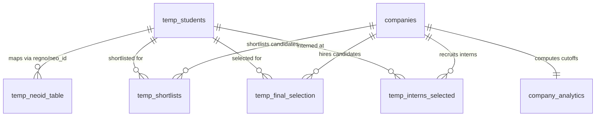

# 🎓 Placement Tracker (2027 Batch) - Comprehensive Technical Summary

## 📌 Executive Overview

**Placement Tracker** is a high-performance, full-stack enterprise platform engineered for managing placement drives, student shortlists, final placement offers, internship selections, academic cutoffs, and statistical predictions for the **2027 Batch** (VIT). 

The platform aggregates multi-source student records (master registration data, Neo IDs, academic CGPA/10th/12th percentages, TopCoder ratings, and resume links), tracks multi-round shortlists per recruiting company, and computes real-time selection analytics and eligibility predictions.

---

## 🏗️ Architecture & Technology Stack

```
                               ┌────────────────────────────────────────┐
                               │           Svelte 5 + Vite 5            │
                               │      (Tailwind CSS v4 + Jakarta)       │
                               └──────────────────┬─────────────────────┘
                                                  │ HTTP / REST APIs
                                                  ▼
                               ┌────────────────────────────────────────┐
                               │             Hono.js Server             │
                               │        (Node.js @hono/node-server)     │
                               └──────────────────┬─────────────────────┘
                                                  │ Direct SQL Prepared Statements
                                                  ▼
                               ┌────────────────────────────────────────┐
                               │         SQLite Database Engine         │
                               │      (better-sqlite3 + NOCASE Index)   │
                               └────────────────────────────────────────┘
```

| Component | Technology | Description |
|---|---|---|
| **Backend API** | Hono.js | Fast TypeScript web framework running on Node.js |
| **Database** | SQLite3 (`better-sqlite3`) | High-concurrency relational database with synchronous WAL mode & NOCASE indexes |
| **Frontend Framework** | Svelte 5 + TypeScript | Reactive component architecture with zero virtual DOM overhead |
| **Bundler / Dev Server**| Vite 5 | Instant HMR development server & production builder |
| **Styling & UI** | Tailwind CSS v4 + Plus Jakarta Sans | Custom glassmorphic design system, smooth scrollbars, dark mode, and vibrant gradients |
| **Deployment** | Docker & Docker Compose | Containerized dual-service deployment with multi-stage builds |

---

## 🗄️ Database Architecture & Full Schema

The SQLite database (`placement.db`) contains 7 core tables designed for high-performance candidate matching and aggregation.



### 1. `temp_students` (Master Candidate Directory)
Stores all candidates across campuses with academic history and placement statuses.

| Column | Type | Constraints | Description |
|---|---|---|---|
| `id` | `INTEGER` | `PRIMARY KEY AUTOINCREMENT` | Internal candidate ID |
| `regno` | `TEXT` | `UNIQUE NOT NULL` | Candidate Registration Number (e.g. `23BCE1087`) |
| `name` | `TEXT` | `NOT NULL` | Full Name |
| `email` | `TEXT` | — | Institutional VIT Email |
| `phone` | `TEXT` | — | Primary Phone Number |
| `personal_email` | `TEXT` | — | Personal Email Address |
| `gender` | `TEXT` | — | Male / Female |
| `cgpa` | `REAL` | — | Cumulative Grade Point Average (0.00 - 10.00) |
| `tenth_marks` | `REAL` | — | 10th Standard Percentage (%) |
| `twelfth_marks`| `REAL` | — | 12th Standard Percentage (%) |
| `dob` | `TEXT` | — | Candidate Date of Birth |
| `resume_link` | `TEXT` | — | Direct link to Google Drive/PDF resume |
| `branch` | `TEXT` | — | Extracted Branch Code (e.g. `BCE`, `BAI`, `BPS`) |
| `campus` | `TEXT` | `DEFAULT 'Unknown'` | Campus Location (`Chennai`, `Vellore`, `Bhopal`, `AP`) |
| `placed` | `BOOLEAN`| `DEFAULT 0` | Full-time Placement Offer Flag (1 = Placed) |
| `final_company_id` | `INTEGER` | `FOREIGN KEY -> companies(id)` | ID of company candidate accepted offer from |
| `neo_id` | `TEXT` | — | Unique Institutional Neo ID (e.g. `B6B1O8G8`) |
| `masters` | `BOOLEAN`| `DEFAULT 0` | Higher Studies / Masters Status Flag |
| `status` | `TEXT` | `DEFAULT 'not_placed'`| Status: `placed`, `intern`, `masters`, `not_placed` |
| `topcoder` | `BOOLEAN`| `DEFAULT 0` | TopCoder Competitive Programmer Flag |

### 2. `temp_neoid_table` (Neo ID Mapping)
Maintains historical mapping between Neo IDs and candidate Registration Numbers.

| Column | Type | Constraints | Description |
|---|---|---|---|
| `neoid` | `TEXT` | `PRIMARY KEY` | Neo ID Identifier |
| `regno` | `TEXT` | — | Associated Registration Number |
| `name` | `TEXT` | — | Candidate Name |
| `campus` | `TEXT` | — | Associated Campus Location |

### 3. `companies` (Company Profile Directory)
Stores recruiting company profiles, requirements, and job drive criteria.

| Column | Type | Constraints | Description |
|---|---|---|---|
| `id` | `INTEGER` | `PRIMARY KEY AUTOINCREMENT` | Internal Company ID |
| `name` | `TEXT` | `UNIQUE NOT NULL` | Company Name (e.g. `Saviynt`) |
| `category` | `TEXT` | — | Hiring Category (e.g. `Super Dream Internship/ Placement`) |
| `role` | `TEXT` | — | Job Profile / Role (e.g. `Associate Engineer / SRE`) |
| `ctc` | `TEXT` | — | CTC Package (e.g. `21,00,000 (21 LPA)`) |
| `stipend` | `TEXT` | — | Monthly Internship Stipend (e.g. `50,000 / month`) |
| `job_location` | `TEXT` | — | Job Location (e.g. `Bengaluru`, `Remote`) |
| `eligible_branches`| `TEXT` | — | Eligible Degree Branches (e.g. `B.Tech CSE, IT & ECE`) |
| `eligibility_criteria`| `TEXT` | — | Academic Criteria (e.g. `90% in 10th/12th, 9.0 CGPA`) |
| `website` | `TEXT` | — | Official Corporate Website (e.g. `saviynt.com`) |
| `total_rounds` | `INTEGER` | — | Total Interview / Selection Rounds |
| `experience_required`| `TEXT` | — | Target Batch / Experience (e.g. `Freshers (2027 batch)`) |
| `notes` | `TEXT` | — | General Drive Notes |
| `round_details` | `TEXT` | — | Round-by-round interview process instructions |

### 4. `temp_shortlists` (Multi-Round Shortlists)
Tracks candidate shortlists across multiple rounds (`Shortlist 1`, `Shortlist 2`, `Technical Interview`, etc.).

| Column | Type | Constraints | Description |
|---|---|---|---|
| `id` | `INTEGER` | `PRIMARY KEY AUTOINCREMENT` | Shortlist Record ID |
| `regno` | `TEXT` | — | Candidate Registration Number |
| `neo_id` | `TEXT` | — | Candidate Neo ID |
| `company_id` | `INTEGER` | `FOREIGN KEY -> companies(id)` | Associated Company ID |
| `round_number` | `INTEGER` | `DEFAULT 1` | Shortlist Round Index (1, 2, 3...) |
| `round_name` | `TEXT` | `DEFAULT 'Shortlist 1'` | Display Round Title |
| `shortlisted_at`| `TEXT` | `DEFAULT CURRENT_TIMESTAMP` | Shortlist Upload Timestamp |

### 5. `temp_final_selection` (Full-Time Placements)
Stores candidates who received final full-time placement offers.

| Column | Type | Constraints | Description |
|---|---|---|---|
| `id` | `INTEGER` | `PRIMARY KEY AUTOINCREMENT` | Selection ID |
| `regno` | `TEXT` | — | Candidate Registration Number |
| `neo_id` | `TEXT` | — | Candidate Neo ID |
| `company_id` | `INTEGER` | `FOREIGN KEY -> companies(id)` | Hiring Company ID |
| `selected_at` | `TEXT` | `DEFAULT CURRENT_TIMESTAMP` | Offer Confirmation Timestamp |

### 6. `temp_interns_selected` (Internship Selections)
Stores candidates who secured internship offers.

| Column | Type | Constraints | Description |
|---|---|---|---|
| `id` | `INTEGER` | `PRIMARY KEY AUTOINCREMENT` | Internship Record ID |
| `regno` | `TEXT` | — | Candidate Registration Number |
| `neo_id` | `TEXT` | — | Candidate Neo ID |
| `company_id` | `INTEGER` | `FOREIGN KEY -> companies(id)` | Internship Company ID |
| `selected_at` | `TEXT` | `DEFAULT CURRENT_TIMESTAMP` | Selection Timestamp |

### 7. `company_analytics` (Automated Cutoffs & Statistical Summary)
Automatically updated statistics table aggregated from candidate shortlist and selection datasets.

| Column | Type | Description |
|---|---|---|
| `company_id` | `INTEGER` | `PRIMARY KEY (FOREIGN KEY -> companies(id))` |
| `min_cgpa_shortlist` | `REAL` | Minimum CGPA among shortlisted candidates |
| `avg_cgpa_shortlist` | `REAL` | Average CGPA of shortlisted candidates |
| `min_tenth_shortlist` | `REAL` | Minimum 10th % among shortlisted candidates |
| `avg_tenth_shortlist` | `REAL` | Average 10th % of shortlisted candidates |
| `min_twelfth_shortlist` | `REAL` | Minimum 12th % among shortlisted candidates |
| `avg_twelfth_shortlist` | `REAL` | Average 12th % of shortlisted candidates |
| `total_shortlisted` | `INTEGER` | Total unique candidates shortlisted |
| `male_count_shortlist` | `INTEGER` | Male candidate count in shortlists |
| `female_count_shortlist` | `INTEGER` | Female candidate count in shortlists |
| `gender_ratio_shortlist` | `TEXT` | Formatted male-to-female ratio (e.g. `2.5:1`) |
| `min_cgpa_selected` | `REAL` | Minimum CGPA among finally selected candidates |
| `avg_cgpa_selected` | `REAL` | Average CGPA of finally selected candidates |
| `min_tenth_selected` | `REAL` | Minimum 10th % among selected candidates |
| `avg_tenth_selected` | `REAL` | Average 10th % of selected candidates |
| `min_twelfth_selected` | `REAL` | Minimum 12th % among selected candidates |
| `avg_twelfth_selected` | `REAL` | Average 12th % of selected candidates |
| `total_selected` | `INTEGER` | Total candidates finally selected |
| `male_count_selected` | `INTEGER` | Male count among selected |
| `female_count_selected` | `INTEGER` | Female count among selected |
| `gender_ratio_selected` | `TEXT` | Formatted male-to-female selection ratio |
| `selection_ratio` | `REAL` | Selection percentage (`total_selected / total_shortlisted * 100`) |

---

## 🔗 How Database Records Are Joined

1. **Candidate Matching (COALESCE Fallback Join)**:
   When candidate lists (shortlists or selections) contain either a Registration Number or a Neo ID, records are joined against `temp_students` and `temp_neoid_table` using case-insensitive `NOCASE` SQLite indexes:
   ```sql
   LEFT JOIN temp_students s ON 
     (ts.regno IS NOT NULL AND LOWER(s.regno) = LOWER(ts.regno)) OR
     (ts.neo_id IS NOT NULL AND LOWER(s.neo_id) = LOWER(ts.neo_id))
   LEFT JOIN temp_neoid_table n ON 
     (ts.neo_id IS NOT NULL AND LOWER(n.neoid) = LOWER(ts.neo_id)) OR
     (ts.regno IS NOT NULL AND LOWER(n.regno) = LOWER(ts.regno))
   ```

2. **Campus & Merit Candidate Ranking**:
   When viewing shortlisted or selected candidates for any company, candidate profiles are deterministically sorted using a 3-tier priority rule:
   - **Tier 1 (Campus Priority)**: `Chennai` (Rank 1) ➔ `Vellore` (Rank 2) ➔ `Unknown / Others` (Rank 3)
   - **Tier 2 (Competitive Flag)**: `TopCoder = 1` candidates first
   - **Tier 3 (Academic Merit)**: `CGPA` descending

3. **Multi-Round Shortlists Join**:
   Company detail view groups shortlists by `round_number` and retrieves associated candidates:
   ```sql
   SELECT ts.round_number, ts.round_name,
          COALESCE(s.regno, n.regno, ts.regno) AS regno,
          COALESCE(s.neo_id, n.neoid, ts.neo_id) AS neo_id,
          COALESCE(s.name, n.name, 'Unknown Candidate') AS name,
          COALESCE(s.campus, n.campus, 'Unknown') AS campus,
          s.cgpa, s.gender, s.resume_link, s.topcoder
   FROM temp_shortlists ts
   LEFT JOIN temp_students s ON (LOWER(s.regno) = LOWER(ts.regno) OR LOWER(s.neo_id) = LOWER(ts.neo_id))
   LEFT JOIN temp_neoid_table n ON (LOWER(n.neoid) = LOWER(ts.neo_id) OR LOWER(n.regno) = LOWER(ts.regno))
   WHERE ts.company_id = ?
   ORDER BY ts.round_number ASC, campus_rank ASC, s.topcoder DESC, s.cgpa DESC
   ```
